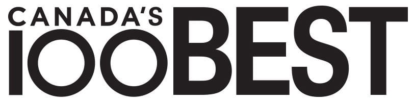

# 💪 Growth Mindset 💪

### Personal Defintion

The growth mindset, as defined by me, is the ability to perservere in the face of adversity. From taking advantage of all the resources at your disposal to working through a difficult problem by sheer force of will. It is important to think of any failure as a learning experience and to become stronger from that failure.

### Reminders

1. Never give up when faced with a difficult task

2. Consult peers and superiors when trying to get another view of on a problem

3. Be positive in all aspects of learning and life

### Biography

Personally, I have had to overcome the struggles of the coronavirus when I lost my job in my regions last lock-down. I was a Cordon Bleu graduate and had been working at [Les Fougeres](https://www.fougeres.com/) in Chelsea, Québec for 2 years. I was fortunate to work with one of the best chefs in Canada and to be awarded 61st in **Canada's 100 Best Restaurants 2020**! 
  
   

I am lucky to be now attending Code Fellows and working towards a career as a Front End Developer!

### Contact Information

- Phone: +1(425)208-9863
- Email: antoineocharette@gmail.com

#### GitHub Portfolio Page

https://github.com/DevAOC
