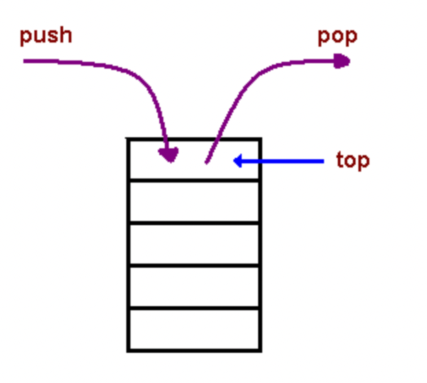

[Home Page](https://devaoc.github.io/reading-notes/)

# Class 14 Notes

## Understanding the JavaScript Call Stack

A call is a function invocation.

A call stack is a data structure that uses the Last In First Out principle.

LIFO means Last In First Out.

LIFO image:

A stack overflow happens when there is a recursive function that does not have an exit.

## JavaScript error messages

A reference error is similar and almost analogous to the error type you get when you have not yet declared a variable.

A syntax error is when you have a mistake in syntax and it is not fixed before compiling.

A range error is what happens when you try to use or give a length to an object that doesnt have a length or it is an invalid length.

A type error is the kind of error you get when trying to use or access two incompatible variable types.

A breakpoint is when you put a debugger in your code and it stops the code at that point.

The word debugger is a breakpoint that opens the debugger in the developer tools.

## Things I want to know more about
